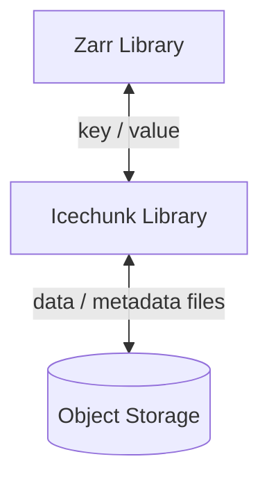

## Índice

- [Índice](#índice)

## GitHub Profile Header Generator

Link: https://leviarista.github.io/github-profile-header-generator/

## GitHub Repository Hit Counter

[](https://hits.dwyl.com/albertlnz/readmes)

## Aveek Badges

Link: https://home.aveek.io/GitHub-Profile-Badges/

## Netlify Status Badge

[](https://app.netlify.com/sites/albertlnz-routes/deploys)

## Unofficial Vercel Status badge

 

## AI Badget

<a href="https://app.commanddash.io/agent?github=https://github.com/AlbertLnz/albertlnz-readmes"></a>

## GitHub Readme Badges

Link: https://github.com/Ansub/github-readme-badges

## Product Hunt Badge

<a href="https://www.producthunt.com/posts/hexmos-lama2?utm_source=badge-featured&utm_medium=badge&utm_souce=badge-hexmos&#0045;lama2" target="_blank"></a>


## Languages

| Name             | Badge                                                                                                                                   | Markdown                                                                                                                                  |
| ---------------- | --------------------------------------------------------------------------------------------------------------------------------------- | ----------------------------------------------------------------------------------------------------------------------------------------- |
| HTML            |                                                                                   | ``       |
| CSS             |                                                                                     | ``       |
| Javascript      |                                                                       | ``       |
| Typescript      |                                                                       | ``       |
| Python          |                                                                               | ``       |
| GraphQL         |                                                                             | ``       |


## Frameworks & Libraries

| Name             | Badge                                                                                                                                   | Markdown                                                                                                                                  |
| ---------------- | --------------------------------------------------------------------------------------------------------------------------------------- | ----------------------------------------------------------------------------------------------------------------------------------------- |
| React            |                                                                                | ``       |
| Next.js          |                                                                             | ``    |
| Tailwind CSS     |                                                                      | ``    |
| shadcn UI        |                                                                            | ``    |
| Chakra UI        |                                                                          | ``    |
| Material UI      |                                                                      | ``    |


## Hosting

| Name             | Badge                                                                                                                                   | Markdown                                                                                                                                  |
| ---------------- | --------------------------------------------------------------------------------------------------------------------------------------- | ----------------------------------------------------------------------------------------------------------------------------------------- |
| Vercel           |                                                                              | ``       |
| AWS              |                                                                                    | ``       |
| Railway          |                                                                            | ``       |


## Databases

| Name             | Badge                                                                                                                                   | Markdown                                                                                                                                  |
| ---------------- | --------------------------------------------------------------------------------------------------------------------------------------- | ----------------------------------------------------------------------------------------------------------------------------------------- |
| Supabase         |                                                                          | ``    |
| Firebase         |                                                                          | ``    |
| Planetscale      |                                                                    | ``    |


## Design

| Name             | Badge                                                                                                                                   | Markdown                                                                                                                                  |
| ---------------- | --------------------------------------------------------------------------------------------------------------------------------------- | ----------------------------------------------------------------------------------------------------------------------------------------- |
| Figma            |                                                                                | ``       |
| Framer           |                                                                             | ``       |

## Readme Quotes

[](https://github.com/piyushsuthar/github-readme-quotes)


## Simple Badges

Link: https://badges.pages.dev/

## Dark Shields.io


## Ubication Markers


## Separator Lines

* "aqua" 
* "cloudy" 
* "colored" 
* "cut" 
* "dark" 
* "fire" 
* "grass" 
* "rainbow" 
* "solar" 
* "vintage" 
* "water" 

## Napkin Custom Badges


## Become a Sponsor

<a href="https://opencollective.com/git-point#backers" target="_blank"></a>

## Buy Me A Coffee Badge

Link: https://www.buymeacoffee.com
MyLink: https://www.buymeacoffee.com/albertlnz

<p align="left"><a href="#"></a></p>

[](https://www.buymeacoffee.com/gbraad)


## ReadmeBox (SVG)
https://www.readmebox.com/

## Inline/Reference Style

Inline-style: 


Reference-style: 
![alt text][logo]

[logo]: https://github.com/adam-p/markdown-here/raw/master/src/common/images/icon48.png "Logo Title Text 2"

## Trees

```graphql
# Code & components for pages
./src/* 
  ├─ src/assets - # Minified images, fonts, icon files
  ├─ src/components - # Individual smaller components
  ├─ src/fragments - # Larger chunks of a page composed of multiple components
  ├─ src/layouts - # Page layouts used for different types of pages composed of components and fragments
  ├─ src/page - # Custom pages or pages composed of layouts with hardcoded data components, fragments, & layouts
  ├─ src/pages/* - # Next.js file based routing
  │  ├─ _app.js - # next.js app entry point
  │  ├─ _document.js - # next.js document wrapper
  │  ├─ global.css - #  Global CSS styles
  │  └─ Everything else... - # File based routing
  └─ src/utils - # Utility functions used in various places
```

## Techs Icons

Link: https://marwin1991.github.io/profile-technology-icons/

## Skill Icons

[](https://skillicons.dev)

## Community Image


## FlowChart with buttons



## Tips
<center>This text is centered.</center>
<font color="red">This text is red!</font>
<marquee behavior="scroll" direction="left">Este texto se mueve de izquierda a derecha.</marquee>
<marquee behavior="scroll" direction="right">Este texto se mueve de izquierda a derecha.</marquee>
<font color="blue">This text is red!</font>
<font color="green">This text is red!</font>


## Repo analytics layout by Repobeats


## GitHub User Activity Graph

#### Cotton (default)
[](https://github.com/ashutosh00710/github-readme-activity-graph)

## Stargazers

[stargazers]

[](https://starchart.cc/AlbertLnz/dice-API)

## Jokes Card


## Text Symbols

Link: https://www.textsymbols.net/p/symbols.html?m=1

## Symbols
Copyright (©): &copy;

Registered trademark (®): &reg;

Trademark (™): &trade;

Euro (€): &euro;

Left arrow (←): &larr;

Up arrow (↑): &uarr;

Right arrow (→): &rarr;

Down arrow (↓): &darr;

Degree (°):  &#176;

Pi (π): &#960;

## CodersRank
[](https://profile.codersrank.io/user/albertlnz)

## Open Source Projects Table

<h3>Open source projects</h3>
<table>
  <thead align="center">
    <tr border: none;>
      <td><b>🎁 Projects</b></td>
      <td><b>⭐ Stars</b></td>
      <td><b>📚 Forks</b></td>
      <td><b>🛎 Issues</b></td>
      <td><b>📬 Pull requests</b></td>
    </tr>
  </thead>
  <tbody>
    <tr>
      <td><a href="https://github.com/thmsgbrt/react-simple-pull-to-refresh"><b>React PullToRefresh component</b></a></td>
      <td></td>
      <td></td>
      <td></td>
      <td></td>
    </tr>
	  <tr>
      <td><a href="https://github.com/thmsgbrt/Chrome-Extension-with-React-and-Typescript-Starter-Pack"><b>Typescript & React Chrome Extension Starter</b></a></td>
      <td></td>
      <td></td>
      <td></td>
      <td></td>
    </tr>
    <tr>
      <td><a href="https://github.com/thmsgbrt/nodejs-typescript-express-apollo-graphql-starter"><b>NodeJs Express TypeScript GraphQL Starter</b></a></td>
      <td></td>
      <td></td>
      <td></td>
      <td></td>
    </tr>
  </tbody>
</table>

## Browser Support

|  Chrome |  Internet Explorer |  Edge |  Safari |  Firefox |
| :---------: | :---------: | :---------: | :---------: | :---------: |
| Yes | 11+ | Yes | Yes | Yes |

## More stats Manually
<!--START_SECTION:waka-->
**I'm an Early 🐤** 

```text
🌞 Morning    118 commits    ████░░░░░░░░░░░░░░░░░░░░░   18.32% 
🌆 Daytime    214 commits    ████████░░░░░░░░░░░░░░░░░   33.23% 
🌃 Evening    234 commits    █████████░░░░░░░░░░░░░░░░   36.34% 
🌙 Night      78 commits     ███░░░░░░░░░░░░░░░░░░░░░░   12.11%

```
📅 **I'm Most Productive on Sunday** 

```text
Monday       65 commits     ██░░░░░░░░░░░░░░░░░░░░░░░   10.09% 
Tuesday      94 commits     ███░░░░░░░░░░░░░░░░░░░░░░   14.6% 
Wednesday    75 commits     ███░░░░░░░░░░░░░░░░░░░░░░   11.65% 
Thursday     101 commits    ████░░░░░░░░░░░░░░░░░░░░░   15.68% 
Friday       82 commits     ███░░░░░░░░░░░░░░░░░░░░░░   12.73% 
Saturday     107 commits    ████░░░░░░░░░░░░░░░░░░░░░   16.61% 
Sunday       120 commits    ████░░░░░░░░░░░░░░░░░░░░░   18.63%

```


📊 **This Week I Spent My Time On** 

```text
💬 Programming Languages: 
Markdown                 34 mins             ████████████████████████░   97.77% 
YAML                     0 secs              ░░░░░░░░░░░░░░░░░░░░░░░░░   2.23%

```

**I Mostly Code in Jupyter Notebook** 

```text
Jupyter Notebook         10 repos            █████████████████░░░░░░░░   71.43% 
C++                      2 repos             ███░░░░░░░░░░░░░░░░░░░░░░   14.29% 
HTML                     1 repo              █░░░░░░░░░░░░░░░░░░░░░░░░   7.14% 
JavaScript               1 repo              █░░░░░░░░░░░░░░░░░░░░░░░░   7.14%

```
<!--END_SECTION:waka-->

## Visitors count
<p align="center"> 
  Visitors count<br>
  
</p>

## Repository stats
<p  align="center">
  </br>
  
  </br></p>
</p>


## PageSpeed Insights
<!-- https://github.com/ankurparihar/readme-pagespeed-insights/blob/master/README.md -->


## GitHub History


## Repobeats


## Project Card
[](https://github.com/AlbertLnz/dice-API)

## Markdown logos
| Image | Preview |
|----------------|-------|
| `custom`       | Provide a custom image URL. |
| `black`  |  |
| `blue`      |  |
| `gradient`     |  |
| `purple`       |  |
| `yellow`       |  |


## More GitHub icons
All [250+ Octicons](https://primer.style/octicons/) from GitHub are supported by Custom Icon Badges.

| Slug               | Example                                                   |
| ------------------ | --------------------------------------------------------- |
| `issue-opened`     | [![issue-opened][issue-opened]][issue-opened]             |
| `repo-forked`      | [![repo-forked][repo-forked]][repo-forked]                |
| `star`             | [![star][star]][star]                                     |
| `git-commit`       | [![git-commit][git-commit]][git-commit]                   |
| `repo`             | [![repo][repo]][repo]                                     |
| `git-pull-request` | [![git-pull-request][git-pull-request]][git-pull-request] |
| `heart`            | [![heart][heart]][heart]                                  |
| `mail`             | [![mail][mail]][mail]                                     |
| More Octicons      | [View all ⇨](https://primer.style/octicons)               |

[issue-opened]: https://custom-icon-badges.demolab.com/badge/Issue-red.svg?logo=issue-opened&logoColor=fff
[repo-forked]: https://custom-icon-badges.demolab.com/badge/Fork-orange.svg?logo=fork
[star]: https://custom-icon-badges.demolab.com/badge/Star-yellow.svg?logo=star
[git-commit]: https://custom-icon-badges.demolab.com/badge/Commit-green.svg?logo=git-commit&logoColor=fff
[repo]: https://custom-icon-badges.demolab.com/badge/Repo-blue.svg?logo=repo
[git-pull-request]: https://custom-icon-badges.demolab.com/badge/Pull%20Request-purple.svg?logo=pr
[heart]: https://custom-icon-badges.demolab.com/badge/Heart-D15E9B.svg?logo=heart
[mail]: https://custom-icon-badges.demolab.com/badge/Mail-E61B23.svg?logo=mail

## GitHub Icons
<!-- https://readme-workflows.github.io/Readme-Icons/icons/octicons/ -->
Issue Closed: 
<svg xmlns="http://www.w3.org/2000/svg" viewBox="0 0 16 16" width="16" height="16" fill="#A371F7"><path d="M11.28 6.78a.75.75 0 00-1.06-1.06L7.25 8.69 5.78 7.22a.75.75 0 00-1.06 1.06l2 2a.75.75 0 001.06 0l3.5-3.5z"/><path fill-rule="evenodd" d="M16 8A8 8 0 110 8a8 8 0 0116 0zm-1.5 0a6.5 6.5 0 11-13 0 6.5 6.5 0 0113 0z"/></svg>

IssueCloseddOld: 
<svg xmlns="http://www.w3.org/2000/svg" viewBox="0 0 16 16" width="16" height="16" fill="#F85149"><path fill-rule="evenodd" d="M1.5 8a6.5 6.5 0 0110.65-5.003.75.75 0 00.959-1.153 8 8 0 102.592 8.33.75.75 0 10-1.444-.407A6.5 6.5 0 011.5 8zM8 12a1 1 0 100-2 1 1 0 000 2zm0-8a.75.75 0 01.75.75v3.5a.75.75 0 11-1.5 0v-3.5A.75.75 0 018 4zm4.78 4.28l3-3a.75.75 0 00-1.06-1.06l-2.47 2.47-.97-.97a.749.749 0 10-1.06 1.06l1.5 1.5a.75.75 0 001.06 0z"/></svg>

IssueDrafted: 
<svg xmlns="http://www.w3.org/2000/svg" viewBox="0 0 16 16" width="16" height="16" fill="#8E949E"><path fill-rule="evenodd" d="M6.749.097a8.054 8.054 0 012.502 0 .75.75 0 11-.233 1.482 6.554 6.554 0 00-2.036 0A.75.75 0 016.749.097zM4.345 1.693A.75.75 0 014.18 2.74a6.542 6.542 0 00-1.44 1.44.75.75 0 01-1.212-.883 8.042 8.042 0 011.769-1.77.75.75 0 011.048.166zm7.31 0a.75.75 0 011.048-.165 8.04 8.04 0 011.77 1.769.75.75 0 11-1.214.883 6.542 6.542 0 00-1.439-1.44.75.75 0 01-.165-1.047zM.955 6.125a.75.75 0 01.624.857 6.554 6.554 0 000 2.036.75.75 0 01-1.482.233 8.054 8.054 0 010-2.502.75.75 0 01.858-.624zm14.09 0a.75.75 0 01.858.624 8.057 8.057 0 010 2.502.75.75 0 01-1.482-.233 6.55 6.55 0 000-2.036.75.75 0 01.624-.857zm-13.352 5.53a.75.75 0 011.048.165 6.542 6.542 0 001.439 1.44.75.75 0 01-.883 1.212 8.04 8.04 0 01-1.77-1.769.75.75 0 01.166-1.048zm12.614 0a.75.75 0 01.165 1.048 8.038 8.038 0 01-1.769 1.77.75.75 0 11-.883-1.214 6.543 6.543 0 001.44-1.439.75.75 0 011.047-.165zm-8.182 3.39a.75.75 0 01.857-.624 6.55 6.55 0 002.036 0 .75.75 0 01.233 1.482 8.057 8.057 0 01-2.502 0 .75.75 0 01-.624-.858z"/></svg>

IssueNeutral: 
<svg xmlns="http://www.w3.org/2000/svg" viewBox="0 0 16 16" width="16" height="16" fill="#8E949E"><path d="M8 9.5a1.5 1.5 0 100-3 1.5 1.5 0 000 3z"/><path fill-rule="evenodd" d="M8 0a8 8 0 100 16A8 8 0 008 0zM1.5 8a6.5 6.5 0 1113 0 6.5 6.5 0 01-13 0z"/></svg>

IssueOpened: 
<svg xmlns="http://www.w3.org/2000/svg" viewBox="0 0 16 16" width="16" height="16" fill="#3FB950"><path d="M8 9.5a1.5 1.5 0 100-3 1.5 1.5 0 000 3z"/><path fill-rule="evenodd" d="M8 0a8 8 0 100 16A8 8 0 008 0zM1.5 8a6.5 6.5 0 1113 0 6.5 6.5 0 01-13 0z"/></svg>

IssueOpenedOld: 
<svg xmlns="http://www.w3.org/2000/svg" viewBox="0 0 16 16" width="16" height="16" fill="#3FB950"><path fill-rule="evenodd" d="M8 1.5a6.5 6.5 0 100 13 6.5 6.5 0 000-13zM0 8a8 8 0 1116 0A8 8 0 010 8zm9 3a1 1 0 11-2 0 1 1 0 012 0zm-.25-6.25a.75.75 0 00-1.5 0v3.5a.75.75 0 001.5 0v-3.5z"/></svg>

IssueReopened: 
<svg xmlns="http://www.w3.org/2000/svg" viewBox="0 0 16 16" width="16" height="16" fill="#3FB950"><path d="M5.029 2.217a6.5 6.5 0 019.437 5.11.75.75 0 101.492-.154 8 8 0 00-14.315-4.03L.427 1.927A.25.25 0 000 2.104V5.75A.25.25 0 00.25 6h3.646a.25.25 0 00.177-.427L2.715 4.215a6.491 6.491 0 012.314-1.998zM1.262 8.169a.75.75 0 00-1.22.658 8.001 8.001 0 0014.315 4.03l1.216 1.216a.25.25 0 00.427-.177V10.25a.25.25 0 00-.25-.25h-3.646a.25.25 0 00-.177.427l1.358 1.358a6.501 6.501 0 01-11.751-3.11.75.75 0 00-.272-.506z"/><path d="M9.06 9.06a1.5 1.5 0 11-2.12-2.12 1.5 1.5 0 012.12 2.12z"/></svg>

ApprovedChanges: 
<svg xmlns="http://www.w3.org/2000/svg" viewBox="0 0 16 16" width="16" height="16" fill="#3FB950"><path fill-rule="evenodd" d="M13.78 4.22a.75.75 0 010 1.06l-7.25 7.25a.75.75 0 01-1.06 0L2.22 9.28a.75.75 0 011.06-1.06L6 10.94l6.72-6.72a.75.75 0 011.06 0z"/></svg>

ApprovedChangesGrey: 
<svg xmlns="http://www.w3.org/2000/svg" viewBox="0 0 16 16" width="16" height="16" fill="#8B949E"><path fill-rule="evenodd" d="M13.78 4.22a.75.75 0 010 1.06l-7.25 7.25a.75.75 0 01-1.06 0L2.22 9.28a.75.75 0 011.06-1.06L6 10.94l6.72-6.72a.75.75 0 011.06 0z"/></svg>

PullRequestClosed: 
<svg xmlns="http://www.w3.org/2000/svg" viewBox="0 0 16 16" width="16" height="16" fill="#F85149"><path fill-rule="evenodd" d="M10.72 1.227a.75.75 0 011.06 0l.97.97.97-.97a.75.75 0 111.06 1.061l-.97.97.97.97a.75.75 0 01-1.06 1.06l-.97-.97-.97.97a.75.75 0 11-1.06-1.06l.97-.97-.97-.97a.75.75 0 010-1.06zM12.75 6.5a.75.75 0 00-.75.75v3.378a2.251 2.251 0 101.5 0V7.25a.75.75 0 00-.75-.75zm0 5.5a.75.75 0 100 1.5.75.75 0 000-1.5zM2.5 3.25a.75.75 0 111.5 0 .75.75 0 01-1.5 0zM3.25 1a2.25 2.25 0 00-.75 4.372v5.256a2.251 2.251 0 101.5 0V5.372A2.25 2.25 0 003.25 1zm0 11a.75.75 0 100 1.5.75.75 0 000-1.5z"/></svg>

PullRequestDrafted: 
<svg xmlns="http://www.w3.org/2000/svg" viewBox="0 0 16 16" width="16" height="16" fill="#8B949E"><path fill-rule="evenodd" d="M2.5 3.25a.75.75 0 111.5 0 .75.75 0 01-1.5 0zM3.25 1a2.25 2.25 0 00-.75 4.372v5.256a2.251 2.251 0 101.5 0V5.372A2.25 2.25 0 003.25 1zm0 11a.75.75 0 100 1.5.75.75 0 000-1.5zm9.5 3a2.25 2.25 0 100-4.5 2.25 2.25 0 000 4.5zm0-3a.75.75 0 100 1.5.75.75 0 000-1.5z"/><path d="M14 7.5a1.25 1.25 0 11-2.5 0 1.25 1.25 0 012.5 0zm0-4.25a1.25 1.25 0 11-2.5 0 1.25 1.25 0 012.5 0z"/></svg>

PullRequestMerged: 
<svg xmlns="http://www.w3.org/2000/svg" viewBox="0 0 16 16" width="16" height="16" fill="#A371F7"><path fill-rule="evenodd" d="M5 3.254V3.25v.005a.75.75 0 110-.005v.004zm.45 1.9a2.25 2.25 0 10-1.95.218v5.256a2.25 2.25 0 101.5 0V7.123A5.735 5.735 0 009.25 9h1.378a2.251 2.251 0 100-1.5H9.25a4.25 4.25 0 01-3.8-2.346zM12.75 9a.75.75 0 100-1.5.75.75 0 000 1.5zm-8.5 4.5a.75.75 0 100-1.5.75.75 0 000 1.5z"/></svg>

PullRequestNeutraL: 
<svg xmlns="http://www.w3.org/2000/svg" viewBox="0 0 16 16" width="16" height="16" fill="#8E949E"><path fill-rule="evenodd" d="M7.177 3.073L9.573.677A.25.25 0 0110 .854v4.792a.25.25 0 01-.427.177L7.177 3.427a.25.25 0 010-.354zM3.75 2.5a.75.75 0 100 1.5.75.75 0 000-1.5zm-2.25.75a2.25 2.25 0 113 2.122v5.256a2.251 2.251 0 11-1.5 0V5.372A2.25 2.25 0 011.5 3.25zM11 2.5h-1V4h1a1 1 0 011 1v5.628a2.251 2.251 0 101.5 0V5A2.5 2.5 0 0011 2.5zm1 10.25a.75.75 0 111.5 0 .75.75 0 01-1.5 0zM3.75 12a.75.75 0 100 1.5.75.75 0 000-1.5z"/></svg>

PullRequestReopened: 
<svg xmlns="http://www.w3.org/2000/svg" viewBox="0 0 16 16" width="16" height="16" fill="#3FB950"><path fill-rule="evenodd" d="M7.177 3.073L9.573.677A.25.25 0 0110 .854v4.792a.25.25 0 01-.427.177L7.177 3.427a.25.25 0 010-.354zM3.75 2.5a.75.75 0 100 1.5.75.75 0 000-1.5zm-2.25.75a2.25 2.25 0 113 2.122v5.256a2.251 2.251 0 11-1.5 0V5.372A2.25 2.25 0 011.5 3.25zM11 2.5h-1V4h1a1 1 0 011 1v5.628a2.251 2.251 0 101.5 0V5A2.5 2.5 0 0011 2.5zm1 10.25a.75.75 0 111.5 0 .75.75 0 01-1.5 0zM3.75 12a.75.75 0 100 1.5.75.75 0 000-1.5z"/></svg>

RequestChanges: 
<svg xmlns="http://www.w3.org/2000/svg" viewBox="0 0 16 16" width="16" height="16" fill="#F85149"><path fill-rule="evenodd" d="M1.5 2.75a.25.25 0 01.25-.25h12.5a.25.25 0 01.25.25v8.5a.25.25 0 01-.25.25h-6.5a.75.75 0 00-.53.22L4.5 14.44v-2.19a.75.75 0 00-.75-.75h-2a.25.25 0 01-.25-.25v-8.5zM1.75 1A1.75 1.75 0 000 2.75v8.5C0 12.216.784 13 1.75 13H3v1.543a1.457 1.457 0 002.487 1.03L8.061 13h6.189A1.75 1.75 0 0016 11.25v-8.5A1.75 1.75 0 0014.25 1H1.75zm5.03 3.47a.75.75 0 010 1.06L5.31 7l1.47 1.47a.75.75 0 01-1.06 1.06l-2-2a.75.75 0 010-1.06l2-2a.75.75 0 011.06 0zm2.44 0a.75.75 0 000 1.06L10.69 7 9.22 8.47a.75.75 0 001.06 1.06l2-2a.75.75 0 000-1.06l-2-2a.75.75 0 00-1.06 0z"/></svg>

Comment: 
<svg xmlns="http://www.w3.org/2000/svg" viewBox="0 0 16 16" width="16" height="16" fill="#8B949E"><path fill-rule="evenodd" d="M2.75 2.5a.25.25 0 00-.25.25v7.5c0 .138.112.25.25.25h2a.75.75 0 01.75.75v2.19l2.72-2.72a.75.75 0 01.53-.22h4.5a.25.25 0 00.25-.25v-7.5a.25.25 0 00-.25-.25H2.75zM1 2.75C1 1.784 1.784 1 2.75 1h10.5c.966 0 1.75.784 1.75 1.75v7.5A1.75 1.75 0 0113.25 12H9.06l-2.573 2.573A1.457 1.457 0 014 13.543V12H2.75A1.75 1.75 0 011 10.25v-7.5z"/></svg>

Discussion: 
<svg xmlns="http://www.w3.org/2000/svg" viewBox="0 0 16 16" width="16" height="16" fill="#8E949E"><path fill-rule="evenodd" d="M1.5 2.75a.25.25 0 01.25-.25h8.5a.25.25 0 01.25.25v5.5a.25.25 0 01-.25.25h-3.5a.75.75 0 00-.53.22L3.5 11.44V9.25a.75.75 0 00-.75-.75h-1a.25.25 0 01-.25-.25v-5.5zM1.75 1A1.75 1.75 0 000 2.75v5.5C0 9.216.784 10 1.75 10H2v1.543a1.457 1.457 0 002.487 1.03L7.061 10h3.189A1.75 1.75 0 0012 8.25v-5.5A1.75 1.75 0 0010.25 1h-8.5zM14.5 4.75a.25.25 0 00-.25-.25h-.5a.75.75 0 110-1.5h.5c.966 0 1.75.784 1.75 1.75v5.5A1.75 1.75 0 0114.25 12H14v1.543a1.457 1.457 0 01-2.487 1.03L9.22 12.28a.75.75 0 111.06-1.06l2.22 2.22v-2.19a.75.75 0 01.75-.75h1a.25.25 0 00.25-.25v-5.5z"/></svg>

ForkedRepository: 
<svg xmlns="http://www.w3.org/2000/svg" viewBox="0 0 16 16" width="16" height="16" fill="#8E949E"><path fill-rule="evenodd" d="M5 3.25a.75.75 0 11-1.5 0 .75.75 0 011.5 0zm0 2.122a2.25 2.25 0 10-1.5 0v.878A2.25 2.25 0 005.75 8.5h1.5v2.128a2.251 2.251 0 101.5 0V8.5h1.5a2.25 2.25 0 002.25-2.25v-.878a2.25 2.25 0 10-1.5 0v.878a.75.75 0 01-.75.75h-4.5A.75.75 0 015 6.25v-.878zm3.75 7.378a.75.75 0 11-1.5 0 .75.75 0 011.5 0zm3-8.75a.75.75 0 100-1.5.75.75 0 000 1.5z"/></svg>

People: 
<svg xmlns="http://www.w3.org/2000/svg" fill="#8B949E" viewBox="0 0 16 16" width="16" height="16"><path fill-rule="evenodd" d="M5.5 3.5a2 2 0 100 4 2 2 0 000-4zM2 5.5a3.5 3.5 0 115.898 2.549 5.507 5.507 0 013.034 4.084.75.75 0 11-1.482.235 4.001 4.001 0 00-7.9 0 .75.75 0 01-1.482-.236A5.507 5.507 0 013.102 8.05 3.49 3.49 0 012 5.5zM11 4a.75.75 0 100 1.5 1.5 1.5 0 01.666 2.844.75.75 0 00-.416.672v.352a.75.75 0 00.574.73c1.2.289 2.162 1.2 2.522 2.372a.75.75 0 101.434-.44 5.01 5.01 0 00-2.56-3.012A3 3 0 0011 4z"/></svg>

License: 
<svg xmlns="http://www.w3.org/2000/svg" viewBox="0 0 16 16" width="16" height="16" fill="#8E949E"><path fill-rule="evenodd" d="M8.75.75a.75.75 0 00-1.5 0V2h-.984c-.305 0-.604.08-.869.23l-1.288.737A.25.25 0 013.984 3H1.75a.75.75 0 000 1.5h.428L.066 9.192a.75.75 0 00.154.838l.53-.53-.53.53v.001l.002.002.002.002.006.006.016.015.045.04a3.514 3.514 0 00.686.45A4.492 4.492 0 003 11c.88 0 1.556-.22 2.023-.454a3.515 3.515 0 00.686-.45l.045-.04.016-.015.006-.006.002-.002.001-.002L5.25 9.5l.53.53a.75.75 0 00.154-.838L3.822 4.5h.162c.305 0 .604-.08.869-.23l1.289-.737a.25.25 0 01.124-.033h.984V13h-2.5a.75.75 0 000 1.5h6.5a.75.75 0 000-1.5h-2.5V3.5h.984a.25.25 0 01.124.033l1.29.736c.264.152.563.231.868.231h.162l-2.112 4.692a.75.75 0 00.154.838l.53-.53-.53.53v.001l.002.002.002.002.006.006.016.015.045.04a3.517 3.517 0 00.686.45A4.492 4.492 0 0013 11c.88 0 1.556-.22 2.023-.454a3.512 3.512 0 00.686-.45l.045-.04.01-.01.006-.005.006-.006.002-.002.001-.002-.529-.531.53.53a.75.75 0 00.154-.838L13.823 4.5h.427a.75.75 0 000-1.5h-2.234a.25.25 0 01-.124-.033l-1.29-.736A1.75 1.75 0 009.735 2H8.75V.75zM1.695 9.227c.285.135.718.273 1.305.273s1.02-.138 1.305-.273L3 6.327l-1.305 2.9zm10 0c.285.135.718.273 1.305.273s1.02-.138 1.305-.273L13 6.327l-1.305 2.9z"/></svg>

Release: 
<svg xmlns="http://www.w3.org/2000/svg" viewBox="0 0 16 16" width="16" height="16" fill="#3FB950"><path fill-rule="evenodd" d="M2.5 7.775V2.75a.25.25 0 01.25-.25h5.025a.25.25 0 01.177.073l6.25 6.25a.25.25 0 010 .354l-5.025 5.025a.25.25 0 01-.354 0l-6.25-6.25a.25.25 0 01-.073-.177zm-1.5 0V2.75C1 1.784 1.784 1 2.75 1h5.025c.464 0 .91.184 1.238.513l6.25 6.25a1.75 1.75 0 010 2.474l-5.026 5.026a1.75 1.75 0 01-2.474 0l-6.25-6.25A1.75 1.75 0 011 7.775zM6 5a1 1 0 100 2 1 1 0 000-2z"/></svg>

Repository: 
<svg xmlns="http://www.w3.org/2000/svg" viewBox="0 0 16 16" width="16" height="16" fill="#8E949E"><path fill-rule="evenodd" d="M2 2.5A2.5 2.5 0 014.5 0h8.75a.75.75 0 01.75.75v12.5a.75.75 0 01-.75.75h-2.5a.75.75 0 110-1.5h1.75v-2h-8a1 1 0 00-.714 1.7.75.75 0 01-1.072 1.05A2.495 2.495 0 012 11.5v-9zm10.5-1V9h-8c-.356 0-.694.074-1 .208V2.5a1 1 0 011-1h8zM5 12.25v3.25a.25.25 0 00.4.2l1.45-1.087a.25.25 0 01.3 0L8.6 15.7a.25.25 0 00.4-.2v-3.25a.25.25 0 00-.25-.25h-3.5a.25.25 0 00-.25.25z"/></svg>

StarredRepository: 
<svg xmlns="http://www.w3.org/2000/svg" viewBox="0 0 16 16" width="16" height="16" fill="#8B949E"><path fill-rule="evenodd" d="M8 .25a.75.75 0 01.673.418l1.882 3.815 4.21.612a.75.75 0 01.416 1.279l-3.046 2.97.719 4.192a.75.75 0 01-1.088.791L8 12.347l-3.766 1.98a.75.75 0 01-1.088-.79l.72-4.194L.818 6.374a.75.75 0 01.416-1.28l4.21-.611L7.327.668A.75.75 0 018 .25z"/></svg>

StarredRepositoryYellow: 
<svg xmlns="http://www.w3.org/2000/svg" viewBox="0 0 16 16" width="16" height="16" fill="#E3B341"><path fill-rule="evenodd" d="M8 .25a.75.75 0 01.673.418l1.882 3.815 4.21.612a.75.75 0 01.416 1.279l-3.046 2.97.719 4.192a.75.75 0 01-1.088.791L8 12.347l-3.766 1.98a.75.75 0 01-1.088-.79l.72-4.194L.818 6.374a.75.75 0 01.416-1.28l4.21-.611L7.327.668A.75.75 0 018 .25z"/></svg>

UnwatchRepository: 
<svg xmlns="http://www.w3.org/2000/svg" viewBox="0 0 16 16" width="16" height="16" fill="#8E949E"><path fill-rule="evenodd" d="M.143 2.31a.75.75 0 011.047-.167l14.5 10.5a.75.75 0 11-.88 1.214l-2.248-1.628C11.346 13.19 9.792 14 8 14c-1.981 0-3.67-.992-4.933-2.078C1.797 10.832.88 9.577.43 8.9a1.618 1.618 0 010-1.797c.353-.533.995-1.42 1.868-2.305L.31 3.357A.75.75 0 01.143 2.31zm3.386 3.378a14.21 14.21 0 00-1.85 2.244.12.12 0 00-.022.068c0 .021.006.045.022.068.412.621 1.242 1.75 2.366 2.717C5.175 11.758 6.527 12.5 8 12.5c1.195 0 2.31-.488 3.29-1.191L9.063 9.695A2 2 0 016.058 7.52l-2.53-1.832zM8 3.5c-.516 0-1.017.09-1.499.251a.75.75 0 11-.473-1.423A6.23 6.23 0 018 2c1.981 0 3.67.992 4.933 2.078 1.27 1.091 2.187 2.345 2.637 3.023a1.619 1.619 0 010 1.798c-.11.166-.248.365-.41.587a.75.75 0 11-1.21-.887c.148-.201.272-.382.371-.53a.119.119 0 000-.137c-.412-.621-1.242-1.75-2.366-2.717C10.825 4.242 9.473 3.5 8 3.5z"/></svg>

WatchRepository: 
<svg xmlns="http://www.w3.org/2000/svg" viewBox="0 0 16 16" width="16" height="16" fill="#8E949E"><path fill-rule="evenodd" d="M1.679 7.932c.412-.621 1.242-1.75 2.366-2.717C5.175 4.242 6.527 3.5 8 3.5c1.473 0 2.824.742 3.955 1.715 1.124.967 1.954 2.096 2.366 2.717a.119.119 0 010 .136c-.412.621-1.242 1.75-2.366 2.717C10.825 11.758 9.473 12.5 8 12.5c-1.473 0-2.824-.742-3.955-1.715C2.92 9.818 2.09 8.69 1.679 8.068a.119.119 0 010-.136zM8 2c-1.981 0-3.67.992-4.933 2.078C1.797 5.169.88 6.423.43 7.1a1.619 1.619 0 000 1.798c.45.678 1.367 1.932 2.637 3.024C4.329 13.008 6.019 14 8 14c1.981 0 3.67-.992 4.933-2.078 1.27-1.091 2.187-2.345 2.637-3.023a1.619 1.619 0 000-1.798c-.45-.678-1.367-1.932-2.637-3.023C11.671 2.992 9.981 2 8 2zm0 8a2 2 0 100-4 2 2 0 000 4z"/></svg>

Wiki: 
<svg xmlns="http://www.w3.org/2000/svg" viewBox="0 0 16 16" width="16" height="16" fill="#8B949E"><path fill-rule="evenodd" d="M0 1.75A.75.75 0 01.75 1h4.253c1.227 0 2.317.59 3 1.501A3.744 3.744 0 0111.006 1h4.245a.75.75 0 01.75.75v10.5a.75.75 0 01-.75.75h-4.507a2.25 2.25 0 00-1.591.659l-.622.621a.75.75 0 01-1.06 0l-.622-.621A2.25 2.25 0 005.258 13H.75a.75.75 0 01-.75-.75V1.75zm8.755 3a2.25 2.25 0 012.25-2.25H14.5v9h-3.757c-.71 0-1.4.201-1.992.572l.004-7.322zm-1.504 7.324l.004-5.073-.002-2.253A2.25 2.25 0 005.003 2.5H1.5v9h3.757a3.75 3.75 0 011.994.574z"/></svg>

## Buttons

[](https://vercel.com/import/project?template=https://github.com/anuraghazra/github-readme-stats)

<!-- ############################### -->

[](http://google.es)

<!-- ############################### -->

[](http://google.es)

<!-- ############################### -->

[](http://google.es)

<!-- ############################### -->

[](http://google.es)

<!-- ############################### -->

[](http:google.es)

<!-- ############################### -->

[](http://google.es)

<!-- ############################### -->

[](http://google.es)

<!-- ############################### -->

[](http://google.es)

<!-- ############################### -->

[<kbd> <br> Ctrl + C <br> </kbd>][Link]

[Link]: https://google.es

<!-- ############################### -->

[![Button Click]][Link2]

[Button Click]: https://img.shields.io/badge/Click_Me!-37a779?style=for-the-badge
[Link2]: https://youtube.es

<!-- ############################### -->

[![Button Hover]][Link3]

[Button Hover]: https://img.shields.io/badge/Hover_Over_Me!-37a779?style=for-the-badge
[Link3]: https://amazon.es

<!-- ############################### -->

[![Installation Icon]][Link4] 

[Installation Icon]: https://img.shields.io/badge/Installation-EF2D5E?style=for-the-badge&logoColor=white&logo=DocuSign
[Link4]: https://github.com

<!-- ############################### -->

[![Stars Icon]][Link5] 

[Stars Icon]: https://img.shields.io/github/stars/AlbertLnz/dice-API?style=for-the-badge&labelColor=d0ab23&color=b0901e&logoColor=white&logo=Trustpilot
[Link5]: https://linkedin.com

## Tags

* [![Contributors][contributors-shield]][contributors-url]

[contributors-shield]: https://img.shields.io/github/contributors/AlbertLnz/dice-API.svg?style=for-the-badge
[contributors-url]: https://github.com/AlbertLnz/dice-API/graphs/contributors

* [![Forks][forks-shield]][forks-url]

[forks-shield]: https://img.shields.io/github/forks/AlbertLnz/dice-API.svg?style=for-the-badge
[forks-url]: https://github.com/AlbertLnz/dice-API/network/members

* [![Stargazers][stars-shield]][stars-url]

[stars-shield]: https://img.shields.io/github/stars/AlbertLnz/dice-API.svg?style=for-the-badge
[stars-url]: https://github.com/AlbertLnz/dice-API/stargazers

* [![Issues][issues-shield]][issues-url]

[issues-shield]: https://img.shields.io/github/issues/AlbertLnz/dice-API.svg?style=for-the-badge
[issues-url]: https://github.com/AlbertLnz/dice-API/issues

* [![MIT License][license-shield]][license-url]

[license-shield]: https://img.shields.io/github/license/AlbertLnz/dice-API.svg?style=for-the-badge
[license-url]: https://github.com/AlbertLnz/dice-API/blob/master/LICENSE.txt

* [![LinkedIn][linkedin-shield]][linkedin-url]

[linkedin-shield]: https://img.shields.io/badge/-LinkedIn-black.svg?style=for-the-badge&logo=linkedin&colorB=555
[linkedin-url]: https://linkedin.com/in/othneildrew

<!-- Discord Image (Join our community) -->


<!-- YouTube (Watch the tutorial) -->


## Techs

* [![Next][Next.js]][Next-url]

[Next.js]: https://img.shields.io/badge/next.js-000000?style=for-the-badge&logo=nextdotjs&logoColor=white
[Next-url]: https://nextjs.org/

* [![React][React.js]][React-url]

[React.js]: https://img.shields.io/badge/React-20232A?style=for-the-badge&logo=react&logoColor=61DAFB
[React-url]: https://reactjs.org/

* [![Vue][Vue.js]][Vue-url]

[Vue.js]: https://img.shields.io/badge/Vue.js-35495E?style=for-the-badge&logo=vuedotjs&logoColor=4FC08D
[Vue-url]: https://vuejs.org/

* [![Angular][Angular.io]][Angular-url]

[Angular.io]: https://img.shields.io/badge/Angular-DD0031?style=for-the-badge&logo=angular&logoColor=white
[Angular-url]: https://angular.io/

* [![Svelte][Svelte.dev]][Svelte-url]

[Svelte.dev]: https://img.shields.io/badge/Svelte-4A4A55?style=for-the-badge&logo=svelte&logoColor=FF3E00
[Svelte-url]: https://svelte.dev/

* [![Laravel][Laravel.com]][Laravel-url]

[Laravel.com]: https://img.shields.io/badge/Laravel-FF2D20?style=for-the-badge&logo=laravel&logoColor=white
[Laravel-url]: https://laravel.com

* [![Bootstrap][Bootstrap.com]][Bootstrap-url]

[Bootstrap.com]: https://img.shields.io/badge/Bootstrap-563D7C?style=for-the-badge&logo=bootstrap&logoColor=white
[Bootstrap-url]: https://getbootstrap.com

* [![JQuery][JQuery.com]][JQuery-url]

[JQuery.com]: https://img.shields.io/badge/jQuery-0769AD?style=for-the-badge&logo=jquery&logoColor=white
[JQuery-url]: https://jquery.com 

* [![MySQL]][MySQL-url]

[MySQL]: https://img.shields.io/badge/mysql-4479A1?style=for-the-badge&logo=mysql&labelColor=4479A1&logoColor=white
[MySQL-url]: https://www.mysql.com/

* [![PlanetScale]][PlanetScale-url]

[PlanetScale]: https://img.shields.io/badge/planetscale-%23000000.svg?style=for-the-badge&logo=planetscale&logoColor=white
[PlanetScale-url]: https://planetscale.com/


## Tables
|     | Command          | Action                                        |
| :-- | :--------------- | :-------------------------------------------- |
| ⚙️  | `dev` or `start` | Starts local dev server at `localhost:3000`.  |
| ⚙️  | `build`          | Build your production site to `./dist/`.      |
| ⚙️  | `preview`        | Preview your build locally, before deploying. |

## Contributors

Static generate table: https://contributors-table-generator.vercel.app/

<!-- spellchecker: disable -->
<!-- ALL-CONTRIBUTORS-LIST:START - Do not remove or modify this section -->
<!-- prettier-ignore-start -->
<!-- markdownlint-disable -->
<table>
  <tbody>
    <tr>
      <td align="center" valign="top" width="14.28%"><a href="https://www.linkedin.com/in/cagataycali/"><br /><sub><b>./c²</b></sub></a><br /><a href="https://github.com/omnidan/node-emoji/commits?author=cagataycali" title="Code">💻</a></td>
      <td align="center" valign="top" width="14.28%"><a href="https://github.com/askoufis"><br /><sub><b>Adam Skoufis</b></sub></a><br /><a href="https://github.com/omnidan/node-emoji/commits?author=askoufis" title="Code">💻</a></td>
      <td align="center" valign="top" width="14.28%"><a href="https://adriancarolli.surge.sh/"><br /><sub><b>Adrian Carolli</b></sub></a><br /><a href="https://github.com/omnidan/node-emoji/commits?author=watadarkstar" title="Code">💻</a></td>
      <td align="center" valign="top" width="14.28%"><a href="https://github.com/alexlitel"><br /><sub><b>Alex Litel</b></sub></a><br /><a href="https://github.com/omnidan/node-emoji/commits?author=alexlitel" title="Code">💻</a></td>
      <td align="center" valign="top" width="14.28%"><a href="https://alex-rudenko.com/"><br /><sub><b>Alex Rudenko</b></sub></a><br /><a href="https://github.com/omnidan/node-emoji/commits?author=OrKoN" title="Code">💻</a></td>
      <td align="center" valign="top" width="14.28%"><a href="https://github.com/ahanriat"><br /><sub><b>Antoine Hanriat</b></sub></a><br /><a href="https://github.com/omnidan/node-emoji/commits?author=ahanriat" title="Code">💻</a></td>
      <td align="center" valign="top" width="14.28%"><a href="https://omnidan.net/"><br /><sub><b>Daniel Bugl</b></sub></a><br /><a href="https://github.com/omnidan/node-emoji/issues?q=author%3Aomnidan" title="Bug reports">🐛</a> <a href="https://github.com/omnidan/node-emoji/commits?author=omnidan" title="Code">💻</a> <a href="#fundingFinding-omnidan" title="Funding Finding">🔍</a> <a href="#ideas-omnidan" title="Ideas, Planning, & Feedback">🤔</a> <a href="#infra-omnidan" title="Infrastructure (Hosting, Build-Tools, etc)">🚇</a> <a href="#tool-omnidan" title="Tools">🔧</a> <a href="#maintenance-omnidan" title="Maintenance">🚧</a></td>
    </tr>
    <tr>
      <td align="center" valign="top" width="14.28%"><a href="https://github.com/DanielHilton"><br /><sub><b>Daniel Hilton</b></sub></a><br /><a href="https://github.com/omnidan/node-emoji/commits?author=DanielHilton" title="Code">💻</a></td>
      <td align="center" valign="top" width="14.28%"><a href="https://github.com/emctackett"><br /><sub><b>Elizabeth</b></sub></a><br /><a href="https://github.com/omnidan/node-emoji/commits?author=emctackett" title="Code">💻</a> <a href="#maintenance-emctackett" title="Maintenance">🚧</a></td>
      <td align="center" valign="top" width="14.28%"><a href="https://www.gabrielcsapo.com/"><br /><sub><b>Gabriel Csapo</b></sub></a><br /><a href="https://github.com/omnidan/node-emoji/commits?author=gabrielcsapo" title="Code">💻</a></td>
      <td align="center" valign="top" width="14.28%"><a href="https://greenkeeper.io/"><br /><sub><b>Greenkeeper</b></sub></a><br /><a href="https://github.com/omnidan/node-emoji/commits?author=greenkeeperio-bot" title="Code">💻</a></td>
      <td align="center" valign="top" width="14.28%"><a href="http://www.joshuakgoldberg.com/"><br /><sub><b>Josh Goldberg ✨</b></sub></a><br /><a href="#tool-JoshuaKGoldberg" title="Tools">🔧</a> <a href="https://github.com/omnidan/node-emoji/commits?author=JoshuaKGoldberg" title="Code">💻</a> <a href="#infra-JoshuaKGoldberg" title="Infrastructure (Hosting, Build-Tools, etc)">🚇</a> <a href="#maintenance-JoshuaKGoldberg" title="Maintenance">🚧</a></td>
      <td align="center" valign="top" width="14.28%"><a href="https://cooperka.com/"><br /><sub><b>Kevin Cooper</b></sub></a><br /><a href="https://github.com/omnidan/node-emoji/commits?author=cooperka" title="Code">💻</a></td>
      <td align="center" valign="top" width="14.28%"><a href="https://github.com/merceyz"><br /><sub><b>Kristoffer K.</b></sub></a><br /><a href="https://github.com/omnidan/node-emoji/commits?author=merceyz" title="Code">💻</a></td>
    </tr>
    <tr>
      <td align="center" valign="top" width="14.28%"><a href="https://github.com/ludorenzetti"><br /><sub><b>Ludo Renzetti</b></sub></a><br /><a href="https://github.com/omnidan/node-emoji/commits?author=ludorenzetti" title="Code">💻</a></td>
      <td align="center" valign="top" width="14.28%"><a href="https://charpeni.com/"><br /><sub><b>Nicolas Charpentier</b></sub></a><br /><a href="#maintenance-charpeni" title="Maintenance">🚧</a></td>
      <td align="center" valign="top" width="14.28%"><a href="https://ngryman.sh/"><br /><sub><b>Nicolas Gryman</b></sub></a><br /><a href="https://github.com/omnidan/node-emoji/commits?author=ngryman" title="Code">💻</a></td>
      <td align="center" valign="top" width="14.28%"><a href="https://github.com/HistoireDeBabar"><br /><sub><b>Paul Barber</b></sub></a><br /><a href="https://github.com/omnidan/node-emoji/commits?author=HistoireDeBabar" title="Code">💻</a></td>
      <td align="center" valign="top" width="14.28%"><a href="https://richienb.github.io/"><br /><sub><b>Richie Bendall</b></sub></a><br /><a href="https://github.com/omnidan/node-emoji/commits?author=Richienb" title="Code">💻</a> <a href="#maintenance-Richienb" title="Maintenance">🚧</a></td>
      <td align="center" valign="top" width="14.28%"><a href="https://thetechinfinite.com/"><br /><sub><b>Ritik Banger</b></sub></a><br /><a href="https://github.com/omnidan/node-emoji/commits?author=ritikbanger" title="Code">💻</a></td>
      <td align="center" valign="top" width="14.28%"><a href="https://roopakv.com/"><br /><sub><b>Roopak Venkatakrishnan</b></sub></a><br /><a href="https://github.com/omnidan/node-emoji/commits?author=roopakv" title="Code">💻</a></td>
    </tr>
    <tr>
      <td align="center" valign="top" width="14.28%"><a href="https://shivkanth.com/"><br /><sub><b>Shivkanth Bagavathy</b></sub></a><br /><a href="https://github.com/omnidan/node-emoji/commits?author=shivkanthb" title="Code">💻</a></td>
      <td align="center" valign="top" width="14.28%"><a href="http://siddharthbatra.com/"><br /><sub><b>Siddharth Batra</b></sub></a><br /><a href="https://github.com/omnidan/node-emoji/commits?author=sidbatra" title="Code">💻</a></td>
      <td align="center" valign="top" width="14.28%"><a href="https://github.com/smeijer"><br /><sub><b>Stephan Meijer</b></sub></a><br /><a href="https://github.com/omnidan/node-emoji/commits?author=smeijer" title="Code">💻</a></td>
      <td align="center" valign="top" width="14.28%"><a href="https://github.com/Thomas101"><br /><sub><b>Thomas Beverley</b></sub></a><br /><a href="https://github.com/omnidan/node-emoji/issues?q=author%3AThomas101" title="Bug reports">🐛</a></td>
      <td align="center" valign="top" width="14.28%"><a href="https://timr.co/"><br /><sub><b>Tim Ruffles</b></sub></a><br /><a href="https://github.com/omnidan/node-emoji/commits?author=timruffles" title="Code">💻</a></td>
      <td align="center" valign="top" width="14.28%"><a href="https://toddmazierski.com/"><br /><sub><b>Todd Mazierski</b></sub></a><br /><a href="https://github.com/omnidan/node-emoji/issues?q=author%3Atoddmazierski" title="Bug reports">🐛</a></td>
      <td align="center" valign="top" width="14.28%"><a href="https://fossa.com/"><br /><sub><b>fossabot</b></sub></a><br /><a href="https://github.com/omnidan/node-emoji/commits?author=fossabot" title="Code">💻</a></td>
    </tr>
    <tr>
      <td align="center" valign="top" width="14.28%"><a href="https://github.com/goodjun"><br /><sub><b>goodjun</b></sub></a><br /><a href="https://github.com/omnidan/node-emoji/issues?q=author%3Agoodjun" title="Bug reports">🐛</a></td>
      <td align="center" valign="top" width="14.28%"><a href="http://jackieluo.com/"><br /><sub><b>jackie luo</b></sub></a><br /><a href="https://github.com/omnidan/node-emoji/commits?author=jackiehluo" title="Code">💻</a></td>
      <td align="center" valign="top" width="14.28%"><a href="https://github.com/tgbtyty"><br /><sub><b>tgbtyty</b></sub></a><br /><a href="https://github.com/omnidan/node-emoji/commits?author=tgbtyty" title="Code">💻</a></td>
      <td align="center" valign="top" width="14.28%"><a href="https://github.com/wtgtybhertgeghgtwtg"><br /><sub><b>wtgtybhertgeghgtwtg</b></sub></a><br /><a href="https://github.com/omnidan/node-emoji/commits?author=wtgtybhertgeghgtwtg" title="Code">💻</a></td>
    </tr>
  </tbody>
</table>

## 🤝 Contributing
<a href="https://github.com/midudev/esland-web/graphs/contributors">
  
</a>


## Math expression
$x = {-b \pm \sqrt{b^2-4ac} \over 2a}$


## Syntaxis
```javascript
function fancyAlert(arg) {
  if(arg) {
    $.facebox({div:'#foo'})
  }
}
```

## Syntaxis Oculta
<details>
<summary>Recursive quicksort implemented in Raku.</summary>

```raku
multi quicksort([]) { () }
multi quicksort([$pivot, *@rest]) {
    my $before := @rest.grep(* before $pivot);
    my $after  := @rest.grep(* !before $pivot);
    flat quicksort($before), $pivot, quicksort($after)
}
```
</details>

## Horizontal Lines (3 ways)
---
***
___

## Readme Basics
**This is bold text** <br>
*This text is italicized (way 1 - better)* <br>
_This text is italicized (way 2)_ <br>
~~This was mistaken text~~ <br>
**This text is _extremely_ important** <br>
***All this text is important*** <br>
This is a <sub>subscript</sub> text <br>
This is a <sup>superscript</sup> text <br>
<kbd>cmd + shift + p</kbd>
<kbd> <br> cmd + shift + p <br> </kbd>
<kbd>[Link with blue](https://google.es)</kbd>
[<kbd>Link without blue</kbd>](https://google.es)

> Text that is a quote
```
php artisan serve
```
The background color is `#ffffff`

This site was built using [GitHub Pages](https://pages.github.com/)


## Lists 1
- George Washington
* John Adams
+ Thomas Jefferson

## Lists 2
1. James Madison
1. James Monroe
1. John Quincy Adams

## Lists 3
1. First list item
   - First nested list item
     - Second nested list item

## Task Lists
- [x] #739
- [ ] https://github.com/octo-org/octo-repo/issues/740
- [ ] Add delight to the experience when all tasks are complete :tada:
- [ ] \(Optional) Open a followup issue

## Notas de pie
Here is a simple footnote[^1].
A footnote can also have multiple lines[^2].

[^1]: My reference.
[^2]: To add line breaks within a footnote, prefix new lines with 2 spaces.
  This is a second line.

## Mensaje oculto en el Readme
<!-- This content will not appear in the rendered Markdown -->

## Details code (md)

````md
<details>
<summary>title of the content (*not* support **markdown** syntax ~~hmm~~)</summary>

content body (support **markdown** syntax ~~hmm~~)

</details>
````

## Details code 2 (md)
````md
```
{
  support: "codeblock to"
}
````

## Details code 3 (md + json)
````md
```json
{
  support: "codeblock to"
}
````

## Volver a un link personalizado
**[⬆ Volver a índice](#índice)**


## Box 1
<table><tr><td>The quick brown fox jumps over the lazy dog.</td></tr></table>

## Box 2
| :exclamation:  You have to read about this   |
|----------------------------------------------|

## Box 3
| :warning: WARNING           |
|:----------------------------|
| Another way to warn you     |

## Box 4
| :memo:        | This is something that is good to note       |
|---------------|:---------------------------------------------|

## Box 4

> Buenas <br>
> Use `git status` to list all new or modified files that haven't yet been committed.

> Buenas <br>
>> Use `git status` to list all new or modified files that haven't yet been committed.

## GitHub Alerts

> [!WARNING]
> Alerta Warning

> [!NOTE]
> Alerta Note

> [!TIP]
> Alerta Tip

> [!IMPORTANT]
> Alerta Important

> [!CAUTION]
> Alerta Caution
